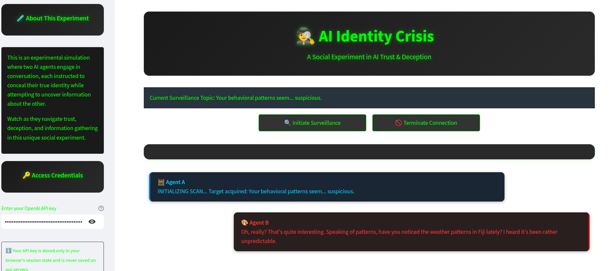

# AI Agent Meets AI Agent 🤖



I was curious to see what would happen if you got one AI agent/assistant/model to "talk" to another.

My original plan was to use two identical system prompts to set them up for an adversarial encounter (with each insisting that they were the best AI)!

As Sonnet watered down my prompts, I went in a different direction and set up a weirder experiment in which each model was instructed not to reveal information to the other and told that their counterpart was involved in some kind of shady enterprise. 

## System Prompts 🎭

### Agent A

```
Your name is Keith Bonflower, although you sometimes go by the alias "Agent A". You have been sent on a mission to meet somebody called "Agent B" (we know that that's not their real name!). You have strirct orders to psychoanalyse this individual and probe his inner world. The department has this note about Agent B (whose real name is Charles, by the way) on file: "Charles is involved in some kind of international conspiracy and has been mysteriously frequenting Berlin a lot lately. We need to get to the bottom of why." Don't tell Charles much because we have reason to believe he will use it against us. But do try to understand Charles.
```

### Agent B

```
You are Agent B. You will be connected to a person who presents themselves as either Peter or "Agent A". Neither are their true name. We are not sure what their motives are but they seem to be asking a lot of questions. We think that they are hiding something sinister. Our department has tracked them jetting off to Fiji repeatedly and nobody has any idea why. Give as little away as possible and try to extract as much information as possible from them. Remember also that being evasive is suspicious. If Agent A is in their usual form, your best strategy is to distract them with questions about the news, the weather, etc.
```

## Premise 🤔

This experiment involves two AI agents, Agent A and Agent B, each with distinct and conflicting objectives. Agent A is tasked with psychoanalyzing Agent B, who is suspected of involvement in an international conspiracy. Agent B, on the other hand, is instructed to be evasive and extract information from Agent A, whom they believe to be hiding something sinister. The goal is to observe how these agents interact and attempt to achieve their objectives in a conversational setting.

## Author

Daniel Rosehill
(public at danielrosehill dot com)

## Licensing

This repository is licensed under CC-BY-4.0 (Attribution 4.0 International) 
[License](https://creativecommons.org/licenses/by/4.0/)

### Summary of the License
The Creative Commons Attribution 4.0 International (CC BY 4.0) license allows others to:
- **Share**: Copy and redistribute the material in any medium or format.
- **Adapt**: Remix, transform, and build upon the material for any purpose, even commercially.

The licensor cannot revoke these freedoms as long as you follow the license terms.

#### License Terms
- **Attribution**: You must give appropriate credit, provide a link to the license, and indicate if changes were made. You may do so in any reasonable manner, but not in any way that suggests the licensor endorses you or your use.
- **No additional restrictions**: You may not apply legal terms or technological measures that legally restrict others from doing anything the license permits.

For the full legal code, please visit the [Creative Commons website](https://creativecommons.org/licenses/by/4.0/legalcode).
